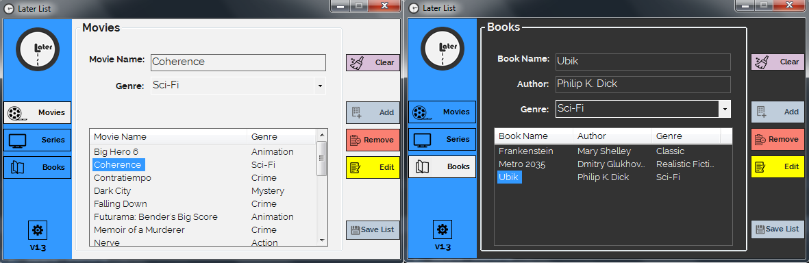

<h1 align="center">
	
</h1>

# What is that thing?
 **Later List** is a simple program to make your own lists for movies, series and books.

# Ok but why would I even need that?
 Sometimes you see a movie, serie or book and think like "I totally need to watch/read that but I don't have time for now, maybe later." and then later you totally forget it. With later list you don't, because you already added it to your list.   

# Why did you develop that? 
 For personal need I think. Also to learn new things. I know there're a lot of fancy websites already to do seperately this but I don't know any for each movie, serie and book. 

# Downloads

| Source | Link | Status |
|---|---|---|
| Download from github | [Later List releases](https://github.com/avodhel/later_list/releases) |  |